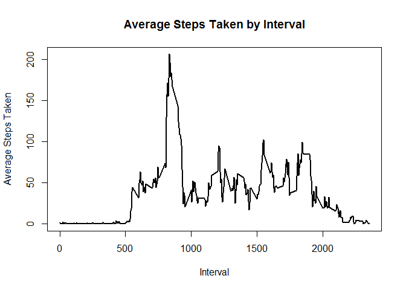
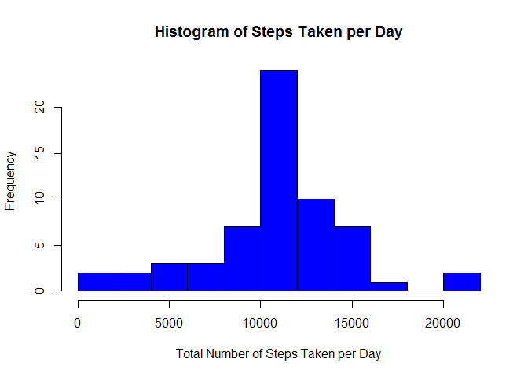
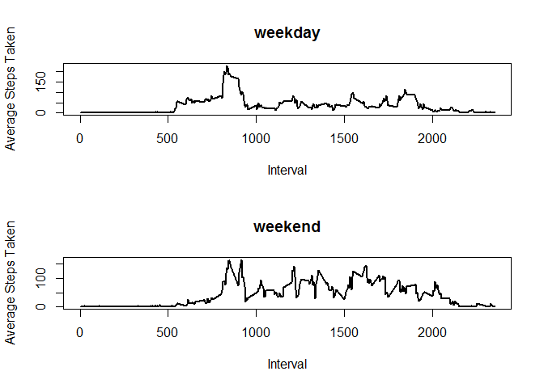

## Introduction

It is now possible to collect a large amount of data about personal movement using activity monitoring devices such as a Fitbit, Nike Fuelband, or Jawbone Up. These type of devices are part of the “quantified self” movement – a group of enthusiasts who take measurements about themselves regularly to improve their health, to find patterns in their behavior, or because they are tech geeks.

The variables included in this dataset are:

* steps: Number of steps taking in a 5-minute interval (missing values are coded as \color{red}{\verb|NA|}NA)
* date: The date on which the measurement was taken in YYYY-MM-DD format
* interval: Identifier for the 5-minute interval in which measurement was taken

## Project  

### 1. Download and Clean Dataset

```r
library(chron)
library(dplyr)
```

```
## 
## Attaching package: 'dplyr'
```

```
## The following objects are masked from 'package:stats':
## 
##     filter, lag
```

```
## The following objects are masked from 'package:base':
## 
##     intersect, setdiff, setequal, union
```

```r
fileUrl <- "https://d396qusza40orc.cloudfront.net/repdata%2Fdata%2Factivity.zip"
download.file(fileUrl, destfile = paste0(getwd(), '/repdata%2Fdata%2Factivity.zip'))
unzip("repdata%2Fdata%2Factivity.zip")

dt <- read.csv("activity.csv")

good <- complete.cases(dt)
dt_clean <- dt[good,]
```

### 2. Total Number of Steps per Taken per Day (Original Dataset)


```r
stepCount <- tapply(dt_clean$steps,dt_clean$date,sum)
bad <- is.na(stepCount)
stepCount <- stepCount[!bad]

hist(stepCount,xlab = "Total Number of Steps Taken per Day", col = "blue",main = "Histogram of Steps Taken per Day",breaks = 15)
```


### 3. Mean and Median of Steps Taken per Day (Original Dataset)


```r
data.frame(Mean = mean(stepCount),Median = median(stepCount))
```

```
##       Mean Median
## 1 10766.19  10765
```

### 4. Average Steps Taken per Interval (Original Dataset)


```r
meanInterval <- tapply(dt_clean$steps,dt_clean$interval,mean)
meanInterval <- data.frame(meanInterval)
meanInterval$interval <- row.names(meanInterval)
colnames(meanInterval) <- c("mean","interval")
meanInterval <- meanInterval[,c("interval","mean")]

plot(meanInterval,type = "l",lwd = 2,xlab = "Interval", ylab = "Average Steps Taken",main = "Average Steps Taken by Interval")
```

<!-- -->

### 5. Interval with Maximum Mean (Original Dataset)


```r
print(meanInterval[meanInterval$mean == max(meanInterval$mean),],row.names = F)
```

```
##  interval     mean
##       835 206.1698
```

### 6.1. Number of Missing Values (Original Dataset)


```r
nrow(dt[!good,])
```

```
## [1] 2304
```

### 6.2. & 6.3. Imputate the mean of the interval where steps values is NA  


```r
dt_imputed <- dt
dt_imputed <- dt_imputed %>% 
    group_by(interval) %>% 
    do(mutate(.,steps = ifelse(is.na(steps),mean(.$steps,na.rm=TRUE),steps))) %>%
    ungroup()%>%
    arrange(.,date,interval)
```

### 6.4. Mean and Median of Steps Taken per Day (Imputed Dataset)

The new mean is equal to the one in the first part of the assignment and the new median differ's. Na's where changed to the mean of the interval and so, as we have several days without recording, the mean of those days is the same as the mean of the hole dataset.


```r
stepCount_imputed <- tapply(dt_imputed$steps,dt_imputed$date,sum)

data.frame(Mean = mean(stepCount_imputed),Median = median(stepCount_imputed))
```

```
##       Mean   Median
## 1 10766.19 10766.19
```

### 7. Histogram of Total Steps Taken per Day (Imputed Dataset)


```r
hist(stepCount_imputed,xlab = "Total Number of Steps Taken per Day", col = "blue",main = "Histogram of Steps Taken per Day", breaks = 15)
```

<!-- -->

### 8. Average Steps Taken per Interval Clasified by Day Type (Imputed Dataset)


```r
dt_imputed$day_type <- factor(ifelse(is.weekend(dt_imputed$date),"weekend","weekday"),levels = c("weekday","weekend"))
dt_imputed <- data.frame(dt_imputed)

day_type_plot <- function(day_type){
    meanInterval <- tapply(dt_imputed[dt_imputed$day_type == day_type,1],dt_imputed[dt_imputed$day_type == day_type,3],mean)
    meanInterval <- data.frame(meanInterval)
    meanInterval$interval <- row.names(meanInterval)
    colnames(meanInterval) <- c("mean","interval")
    meanInterval <- meanInterval[,c("interval","mean")]
    
    plot(meanInterval,type = "l",lwd = 2,xlab = "Interval", ylab = "Average Steps Taken",main = day_type)
}

par(mfrow = c(2,1))

day_type_plot("weekday")
day_type_plot("weekend")
```

<!-- -->
